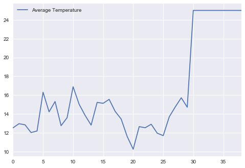
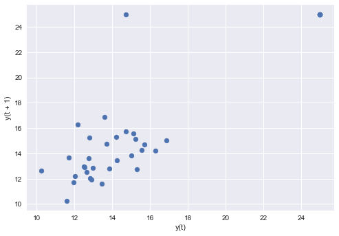
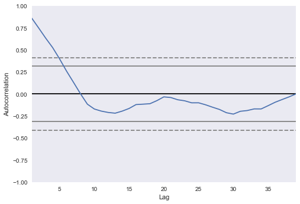
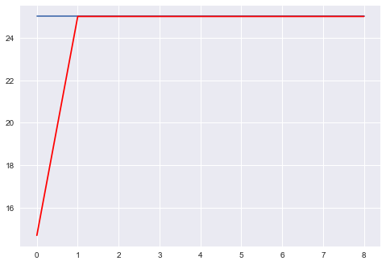
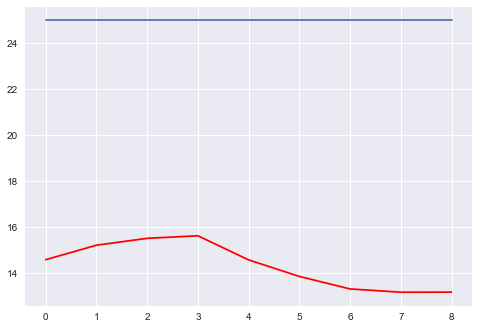
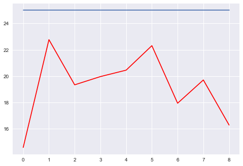

#### Importing libraries


```python
%pylab inline
```
    Populating the interactive namespace from numpy and matplotlib


```python
import scipy
import numpy as np
import pandas as pd
```

```python
from matplotlib import pyplot as plt
```

```python
import seaborn as sns
```
#### Read data


```python
url = "http://www.fifeweather.co.uk/cowdenbeath/200606.csv"
```

```python
data = pd.read_csv(url)
```

```python
#data.dtypes
```

```python
#data.describe()
```

```python
#data.head()
```

```python
data['Date'] = pd.to_datetime(data['Date'], format="%d/%m/%Y")
```

```python
data['Time'] = pd.to_datetime(data['Time'], format='%H:%M').dt.time
```

```python
data = data[(data['Date'].dt.month == 6)]
```

```python
df_Q123 = data[['Date', 'Time', 'Outside Temperature', 'Hi Temperature', 'Low Temperature']]
```

```python
df_Q123.head()
```


<div>
<style>
    .dataframe thead tr:only-child th {
        text-align: right;
    }

    .dataframe thead th {
        text-align: left;
    }

    .dataframe tbody tr th {
        vertical-align: top;
    }
</style>
<table border="1" class="dataframe">
  <thead>
    <tr style="text-align: right;">
      <th></th>
      <th>Date</th>
      <th>Time</th>
      <th>Outside Temperature</th>
      <th>Hi Temperature</th>
      <th>Low Temperature</th>
    </tr>
  </thead>
  <tbody>
    <tr>
      <th>90</th>
      <td>2006-06-01</td>
      <td>00:00:00</td>
      <td>9.6</td>
      <td>9.6</td>
      <td>9.5</td>
    </tr>
    <tr>
      <th>91</th>
      <td>2006-06-01</td>
      <td>00:10:00</td>
      <td>9.5</td>
      <td>9.6</td>
      <td>9.5</td>
    </tr>
    <tr>
      <th>92</th>
      <td>2006-06-01</td>
      <td>00:20:00</td>
      <td>9.5</td>
      <td>9.6</td>
      <td>9.5</td>
    </tr>
    <tr>
      <th>93</th>
      <td>2006-06-01</td>
      <td>00:30:00</td>
      <td>9.5</td>
      <td>9.6</td>
      <td>9.5</td>
    </tr>
    <tr>
      <th>94</th>
      <td>2006-06-01</td>
      <td>00:40:00</td>
      <td>9.5</td>
      <td>9.6</td>
      <td>9.5</td>
    </tr>
  </tbody>
</table>
</div>


```python
days = data['Date'].dt.day.unique()
dfs = []
i=0
for df in days:
    df = df_Q123[df_Q123['Date'].dt.day == i+1]
    dfs.append(df)
    i+=1
```

```python
#dfs[25].head()
dfs[25].describe()
```


<div>
<style>
    .dataframe thead tr:only-child th {
        text-align: right;
    }

    .dataframe thead th {
        text-align: left;
    }

    .dataframe tbody tr th {
        vertical-align: top;
    }
</style>
<table border="1" class="dataframe">
  <thead>
    <tr style="text-align: right;">
      <th></th>
      <th>Outside Temperature</th>
      <th>Hi Temperature</th>
      <th>Low Temperature</th>
    </tr>
  </thead>
  <tbody>
    <tr>
      <th>count</th>
      <td>144.000000</td>
      <td>144.000000</td>
      <td>144.000000</td>
    </tr>
    <tr>
      <th>mean</th>
      <td>11.690278</td>
      <td>11.790278</td>
      <td>11.590278</td>
    </tr>
    <tr>
      <th>std</th>
      <td>2.444612</td>
      <td>2.444612</td>
      <td>2.444612</td>
    </tr>
    <tr>
      <th>min</th>
      <td>7.200000</td>
      <td>7.300000</td>
      <td>7.100000</td>
    </tr>
    <tr>
      <th>25%</th>
      <td>9.900000</td>
      <td>10.000000</td>
      <td>9.800000</td>
    </tr>
    <tr>
      <th>50%</th>
      <td>11.600000</td>
      <td>11.700000</td>
      <td>11.500000</td>
    </tr>
    <tr>
      <th>75%</th>
      <td>14.100000</td>
      <td>14.200000</td>
      <td>14.000000</td>
    </tr>
    <tr>
      <th>max</th>
      <td>15.800000</td>
      <td>15.900000</td>
      <td>15.700000</td>
    </tr>
  </tbody>
</table>
</div>


```python
values = []
for df in dfs:
    values.append(df['Outside Temperature'].max())
print (values)
```
    [17.199999999999999, 17.699999999999999, 19.600000000000001, 18.0, 16.100000000000001, 23.199999999999999, 19.600000000000001, 20.699999999999999, 17.899999999999999, 19.899999999999999, 22.399999999999999, 19.399999999999999, 17.100000000000001, 16.399999999999999, 21.100000000000001, 18.699999999999999, 18.899999999999999, 15.4, 17.300000000000001, 16.300000000000001, 12.6, 16.100000000000001, 16.5, 16.699999999999999, 15.6, 15.800000000000001, 17.699999999999999, 21.399999999999999, 18.100000000000001, 15.9]


```python
index_max = max(range(len(values)), key=values.__getitem__)
```

```python
dfs[index_max].head()
```


<div>
<style>
    .dataframe thead tr:only-child th {
        text-align: right;
    }

    .dataframe thead th {
        text-align: left;
    }

    .dataframe tbody tr th {
        vertical-align: top;
    }
</style>
<table border="1" class="dataframe">
  <thead>
    <tr style="text-align: right;">
      <th></th>
      <th>Date</th>
      <th>Time</th>
      <th>Outside Temperature</th>
      <th>Hi Temperature</th>
      <th>Low Temperature</th>
    </tr>
  </thead>
  <tbody>
    <tr>
      <th>810</th>
      <td>2006-06-06</td>
      <td>00:00:00</td>
      <td>10.3</td>
      <td>10.4</td>
      <td>10.3</td>
    </tr>
    <tr>
      <th>811</th>
      <td>2006-06-06</td>
      <td>00:10:00</td>
      <td>10.2</td>
      <td>10.3</td>
      <td>10.2</td>
    </tr>
    <tr>
      <th>812</th>
      <td>2006-06-06</td>
      <td>00:20:00</td>
      <td>10.1</td>
      <td>10.2</td>
      <td>10.1</td>
    </tr>
    <tr>
      <th>813</th>
      <td>2006-06-06</td>
      <td>00:30:00</td>
      <td>10.1</td>
      <td>10.1</td>
      <td>10.0</td>
    </tr>
    <tr>
      <th>814</th>
      <td>2006-06-06</td>
      <td>00:40:00</td>
      <td>9.9</td>
      <td>10.0</td>
      <td>9.8</td>
    </tr>
  </tbody>
</table>
</div>


```python
dfs[index_max][dfs[index_max]['Outside Temperature'] == dfs[index_max]['Outside Temperature'].max()]
```


<div>
<style>
    .dataframe thead tr:only-child th {
        text-align: right;
    }

    .dataframe thead th {
        text-align: left;
    }

    .dataframe tbody tr th {
        vertical-align: top;
    }
</style>
<table border="1" class="dataframe">
  <thead>
    <tr style="text-align: right;">
      <th></th>
      <th>Date</th>
      <th>Time</th>
      <th>Outside Temperature</th>
      <th>Hi Temperature</th>
      <th>Low Temperature</th>
    </tr>
  </thead>
  <tbody>
    <tr>
      <th>896</th>
      <td>2006-06-06</td>
      <td>14:20:00</td>
      <td>23.2</td>
      <td>23.2</td>
      <td>23.1</td>
    </tr>
  </tbody>
</table>
</div>


```python
dfs[index_max]['Time'][dfs[index_max]['Outside Temperature'] == dfs[index_max]['Outside Temperature'].max()]
```


    896    14:20:00
    Name: Time, dtype: object


## Question 1a output


```python
dfs[index_max]['Time'][dfs[index_max]['Outside Temperature'] == dfs[index_max]['Outside Temperature'].max()].values[0]
```


    datetime.time(14, 20)


```python
times=[]
for df in dfs:
    times.append(df['Time'][df['Outside Temperature'] == df['Outside Temperature'].max()].values[0])
    
    
print (times)    
```
    [datetime.time(15, 0), datetime.time(13, 20), datetime.time(14, 50), datetime.time(16, 10), datetime.time(13, 30), datetime.time(14, 20), datetime.time(13, 0), datetime.time(16, 20), datetime.time(14, 40), datetime.time(13, 0), datetime.time(11, 0), datetime.time(15, 0), datetime.time(13, 40), datetime.time(11, 10), datetime.time(13, 50), datetime.time(14, 50), datetime.time(14, 50), datetime.time(13, 20), datetime.time(14, 50), datetime.time(12, 0), datetime.time(13, 30), datetime.time(14, 40), datetime.time(10, 10), datetime.time(15, 40), datetime.time(10, 20), datetime.time(10, 0), datetime.time(12, 40), datetime.time(10, 40), datetime.time(13, 0), datetime.time(13, 0)]


```python
df_times = pd.DataFrame(times, columns=['Time of daily highs'])
```

```python
df_times.head()
#df_times.describe()
```


<div>
<style>
    .dataframe thead tr:only-child th {
        text-align: right;
    }

    .dataframe thead th {
        text-align: left;
    }

    .dataframe tbody tr th {
        vertical-align: top;
    }
</style>
<table border="1" class="dataframe">
  <thead>
    <tr style="text-align: right;">
      <th></th>
      <th>Time of daily highs</th>
    </tr>
  </thead>
  <tbody>
    <tr>
      <th>0</th>
      <td>15:00:00</td>
    </tr>
    <tr>
      <th>1</th>
      <td>13:20:00</td>
    </tr>
    <tr>
      <th>2</th>
      <td>14:50:00</td>
    </tr>
    <tr>
      <th>3</th>
      <td>16:10:00</td>
    </tr>
    <tr>
      <th>4</th>
      <td>13:30:00</td>
    </tr>
  </tbody>
</table>
</div>


```python
df_times['Time of daily highs'].value_counts().max()
```


    4


## Question 1b output


```python
df_times['Time of daily highs'].value_counts().idxmax()
```


    datetime.time(13, 0)


```python
df_Q1_3 = df_Q123.set_index('Time')
```
## Question 1c output


```python
df_Q1_3.groupby('Date')['Outside Temperature'].nlargest(10)
```


    Date        Time    
    2006-06-01  15:00:00    17.2
                15:10:00    17.2
                14:50:00    17.1
                15:20:00    17.0
                15:30:00    16.8
                14:40:00    16.7
                13:40:00    16.6
                13:50:00    16.6
                15:40:00    16.6
                13:30:00    16.3
    2006-06-02  13:20:00    17.7
                13:30:00    17.6
                13:10:00    17.5
                13:40:00    17.4
                13:50:00    17.4
                14:00:00    17.4
                14:10:00    17.4
                14:20:00    17.4
                14:30:00    17.3
                11:50:00    17.2
    2006-06-03  14:50:00    19.6
                15:00:00    19.6
                14:40:00    19.5
                15:10:00    19.4
                15:20:00    19.4
                14:30:00    19.3
                15:30:00    19.2
                14:20:00    19.1
                15:40:00    19.1
                15:50:00    19.0
                            ... 
    2006-06-28  10:40:00    21.4
                10:50:00    21.4
                10:30:00    21.3
                10:20:00    21.2
                10:10:00    21.1
                10:00:00    21.0
                11:00:00    21.0
                09:50:00    20.9
                11:10:00    20.7
                11:20:00    20.4
    2006-06-29  13:00:00    18.1
                13:10:00    18.1
                13:20:00    18.0
                12:50:00    17.9
                15:40:00    17.9
                15:50:00    17.9
                18:20:00    17.9
                18:30:00    17.9
                18:40:00    17.9
                18:50:00    17.9
    2006-06-30  13:00:00    15.9
                13:10:00    15.9
                13:20:00    15.9
                13:30:00    15.9
                13:40:00    15.9
                13:50:00    15.8
                14:00:00    15.8
                14:10:00    15.8
                14:20:00    15.8
                14:30:00    15.8
    Name: Outside Temperature, Length: 300, dtype: float64


## Question 2


```python
df_low_temp = df_Q123[['Date', 'Time', 'Low Temperature']]
```

```python
df_hi_temp = df_Q123[['Date', 'Time', 'Hi Temperature']]
```

```python
#df_low_temp.head()
#df_hi_temp.head()
```

```python
low_temps = []
i=0
for df in range(0,9):
    df = df_low_temp[df_low_temp['Date'].dt.day == i+1]
    low_temps.append(df)
    i+=1
```

```python
low_temps[3].head()
```


<div>
<style>
    .dataframe thead tr:only-child th {
        text-align: right;
    }

    .dataframe thead th {
        text-align: left;
    }

    .dataframe tbody tr th {
        vertical-align: top;
    }
</style>
<table border="1" class="dataframe">
  <thead>
    <tr style="text-align: right;">
      <th></th>
      <th>Date</th>
      <th>Time</th>
      <th>Low Temperature</th>
    </tr>
  </thead>
  <tbody>
    <tr>
      <th>522</th>
      <td>2006-06-04</td>
      <td>00:00:00</td>
      <td>8.8</td>
    </tr>
    <tr>
      <th>523</th>
      <td>2006-06-04</td>
      <td>00:10:00</td>
      <td>8.7</td>
    </tr>
    <tr>
      <th>524</th>
      <td>2006-06-04</td>
      <td>00:20:00</td>
      <td>8.6</td>
    </tr>
    <tr>
      <th>525</th>
      <td>2006-06-04</td>
      <td>00:30:00</td>
      <td>8.4</td>
    </tr>
    <tr>
      <th>526</th>
      <td>2006-06-04</td>
      <td>00:40:00</td>
      <td>8.2</td>
    </tr>
  </tbody>
</table>
</div>


```python
for x in range(0,9):
        low_temps[x] = low_temps[x].drop(low_temps[x][(low_temps[x]['Low Temperature'] < 10.28) 
                                                      | (low_temps[x]['Low Temperature'] > 10.32)].index)
        print (low_temps[x].head(1))
```
              Date      Time  Low Temperature
    127 2006-06-01  06:10:00             10.3
    Empty DataFrame
    Columns: [Date, Time, Low Temperature]
    Index: []
              Date      Time  Low Temperature
    420 2006-06-03  07:00:00             10.3
              Date      Time  Low Temperature
    659 2006-06-04  22:50:00             10.3
    Empty DataFrame
    Columns: [Date, Time, Low Temperature]
    Index: []
              Date      Time  Low Temperature
    810 2006-06-06  00:00:00             10.3
               Date      Time  Low Temperature
    1081 2006-06-07  21:10:00             10.3
               Date      Time  Low Temperature
    1128 2006-06-08  05:00:00             10.3
               Date      Time  Low Temperature
    1260 2006-06-09  03:00:00             10.3


```python
hi_temps = []
i=0
for df in range(0,9):
    df = df_hi_temp[df_hi_temp['Date'].dt.day == i+1]
    hi_temps.append(df)
    i+=1
```

```python
for x in range(0,9):
        hi_temps[x] = hi_temps[x].drop(hi_temps[x][(hi_temps[x]['Hi Temperature'] < 21.3)
                                                               | (hi_temps[x]['Hi Temperature'] > 23.3)].index)
        print (hi_temps[x].head(5))
```
    Empty DataFrame
    Columns: [Date, Time, Hi Temperature]
    Index: []
    Empty DataFrame
    Columns: [Date, Time, Hi Temperature]
    Index: []
    Empty DataFrame
    Columns: [Date, Time, Hi Temperature]
    Index: []
    Empty DataFrame
    Columns: [Date, Time, Hi Temperature]
    Index: []
    Empty DataFrame
    Columns: [Date, Time, Hi Temperature]
    Index: []
              Date      Time  Hi Temperature
    885 2006-06-06  12:30:00            21.4
    886 2006-06-06  12:40:00            21.6
    887 2006-06-06  12:50:00            21.8
    888 2006-06-06  13:00:00            22.1
    889 2006-06-06  13:10:00            22.4
    Empty DataFrame
    Columns: [Date, Time, Hi Temperature]
    Index: []
    Empty DataFrame
    Columns: [Date, Time, Hi Temperature]
    Index: []
    Empty DataFrame
    Columns: [Date, Time, Hi Temperature]
    Index: []


```python
df_low_temps = pd.concat(low_temps)
```

```python
df_hi_temps = pd.concat(hi_temps)
```

```python
df_low_temps.describe()
#df_low_temps.head()
```


<div>
<style>
    .dataframe thead tr:only-child th {
        text-align: right;
    }

    .dataframe thead th {
        text-align: left;
    }

    .dataframe tbody tr th {
        vertical-align: top;
    }
</style>
<table border="1" class="dataframe">
  <thead>
    <tr style="text-align: right;">
      <th></th>
      <th>Low Temperature</th>
    </tr>
  </thead>
  <tbody>
    <tr>
      <th>count</th>
      <td>1.400000e+01</td>
    </tr>
    <tr>
      <th>mean</th>
      <td>1.030000e+01</td>
    </tr>
    <tr>
      <th>std</th>
      <td>1.843413e-15</td>
    </tr>
    <tr>
      <th>min</th>
      <td>1.030000e+01</td>
    </tr>
    <tr>
      <th>25%</th>
      <td>1.030000e+01</td>
    </tr>
    <tr>
      <th>50%</th>
      <td>1.030000e+01</td>
    </tr>
    <tr>
      <th>75%</th>
      <td>1.030000e+01</td>
    </tr>
    <tr>
      <th>max</th>
      <td>1.030000e+01</td>
    </tr>
  </tbody>
</table>
</div>


```python
#df_hi_temps.describe()
df_hi_temps.head()
```


<div>
<style>
    .dataframe thead tr:only-child th {
        text-align: right;
    }

    .dataframe thead th {
        text-align: left;
    }

    .dataframe tbody tr th {
        vertical-align: top;
    }
</style>
<table border="1" class="dataframe">
  <thead>
    <tr style="text-align: right;">
      <th></th>
      <th>Date</th>
      <th>Time</th>
      <th>Hi Temperature</th>
    </tr>
  </thead>
  <tbody>
    <tr>
      <th>885</th>
      <td>2006-06-06</td>
      <td>12:30:00</td>
      <td>21.4</td>
    </tr>
    <tr>
      <th>886</th>
      <td>2006-06-06</td>
      <td>12:40:00</td>
      <td>21.6</td>
    </tr>
    <tr>
      <th>887</th>
      <td>2006-06-06</td>
      <td>12:50:00</td>
      <td>21.8</td>
    </tr>
    <tr>
      <th>888</th>
      <td>2006-06-06</td>
      <td>13:00:00</td>
      <td>22.1</td>
    </tr>
    <tr>
      <th>889</th>
      <td>2006-06-06</td>
      <td>13:10:00</td>
      <td>22.4</td>
    </tr>
  </tbody>
</table>
</div>


```python
Q2 = pd.merge(df_low_temps, df_hi_temps, how='left', on=['Date'])
```
## Question 2 output


```python
Q2
```


<div>
<style>
    .dataframe thead tr:only-child th {
        text-align: right;
    }

    .dataframe thead th {
        text-align: left;
    }

    .dataframe tbody tr th {
        vertical-align: top;
    }
</style>
<table border="1" class="dataframe">
  <thead>
    <tr style="text-align: right;">
      <th></th>
      <th>Date</th>
      <th>Time_x</th>
      <th>Low Temperature</th>
      <th>Time_y</th>
      <th>Hi Temperature</th>
    </tr>
  </thead>
  <tbody>
    <tr>
      <th>0</th>
      <td>2006-06-01</td>
      <td>06:10:00</td>
      <td>10.3</td>
      <td>NaN</td>
      <td>NaN</td>
    </tr>
    <tr>
      <th>1</th>
      <td>2006-06-01</td>
      <td>21:50:00</td>
      <td>10.3</td>
      <td>NaN</td>
      <td>NaN</td>
    </tr>
    <tr>
      <th>2</th>
      <td>2006-06-03</td>
      <td>07:00:00</td>
      <td>10.3</td>
      <td>NaN</td>
      <td>NaN</td>
    </tr>
    <tr>
      <th>3</th>
      <td>2006-06-03</td>
      <td>21:00:00</td>
      <td>10.3</td>
      <td>NaN</td>
      <td>NaN</td>
    </tr>
    <tr>
      <th>4</th>
      <td>2006-06-04</td>
      <td>22:50:00</td>
      <td>10.3</td>
      <td>NaN</td>
      <td>NaN</td>
    </tr>
    <tr>
      <th>5</th>
      <td>2006-06-04</td>
      <td>23:00:00</td>
      <td>10.3</td>
      <td>NaN</td>
      <td>NaN</td>
    </tr>
    <tr>
      <th>6</th>
      <td>2006-06-06</td>
      <td>00:00:00</td>
      <td>10.3</td>
      <td>12:30:00</td>
      <td>21.4</td>
    </tr>
    <tr>
      <th>7</th>
      <td>2006-06-06</td>
      <td>00:00:00</td>
      <td>10.3</td>
      <td>12:40:00</td>
      <td>21.6</td>
    </tr>
    <tr>
      <th>8</th>
      <td>2006-06-06</td>
      <td>00:00:00</td>
      <td>10.3</td>
      <td>12:50:00</td>
      <td>21.8</td>
    </tr>
    <tr>
      <th>9</th>
      <td>2006-06-06</td>
      <td>00:00:00</td>
      <td>10.3</td>
      <td>13:00:00</td>
      <td>22.1</td>
    </tr>
    <tr>
      <th>10</th>
      <td>2006-06-06</td>
      <td>00:00:00</td>
      <td>10.3</td>
      <td>13:10:00</td>
      <td>22.4</td>
    </tr>
    <tr>
      <th>11</th>
      <td>2006-06-06</td>
      <td>00:00:00</td>
      <td>10.3</td>
      <td>13:20:00</td>
      <td>22.7</td>
    </tr>
    <tr>
      <th>12</th>
      <td>2006-06-06</td>
      <td>00:00:00</td>
      <td>10.3</td>
      <td>13:30:00</td>
      <td>22.8</td>
    </tr>
    <tr>
      <th>13</th>
      <td>2006-06-06</td>
      <td>00:00:00</td>
      <td>10.3</td>
      <td>13:40:00</td>
      <td>23.0</td>
    </tr>
    <tr>
      <th>14</th>
      <td>2006-06-06</td>
      <td>00:00:00</td>
      <td>10.3</td>
      <td>13:50:00</td>
      <td>23.0</td>
    </tr>
    <tr>
      <th>15</th>
      <td>2006-06-06</td>
      <td>00:00:00</td>
      <td>10.3</td>
      <td>14:00:00</td>
      <td>23.1</td>
    </tr>
    <tr>
      <th>16</th>
      <td>2006-06-06</td>
      <td>00:00:00</td>
      <td>10.3</td>
      <td>14:10:00</td>
      <td>23.2</td>
    </tr>
    <tr>
      <th>17</th>
      <td>2006-06-06</td>
      <td>00:00:00</td>
      <td>10.3</td>
      <td>14:20:00</td>
      <td>23.2</td>
    </tr>
    <tr>
      <th>18</th>
      <td>2006-06-06</td>
      <td>00:00:00</td>
      <td>10.3</td>
      <td>14:30:00</td>
      <td>23.2</td>
    </tr>
    <tr>
      <th>19</th>
      <td>2006-06-06</td>
      <td>00:00:00</td>
      <td>10.3</td>
      <td>14:40:00</td>
      <td>23.1</td>
    </tr>
    <tr>
      <th>20</th>
      <td>2006-06-06</td>
      <td>00:00:00</td>
      <td>10.3</td>
      <td>14:50:00</td>
      <td>22.9</td>
    </tr>
    <tr>
      <th>21</th>
      <td>2006-06-06</td>
      <td>00:00:00</td>
      <td>10.3</td>
      <td>15:00:00</td>
      <td>22.9</td>
    </tr>
    <tr>
      <th>22</th>
      <td>2006-06-06</td>
      <td>00:00:00</td>
      <td>10.3</td>
      <td>15:10:00</td>
      <td>22.9</td>
    </tr>
    <tr>
      <th>23</th>
      <td>2006-06-06</td>
      <td>00:00:00</td>
      <td>10.3</td>
      <td>15:20:00</td>
      <td>22.7</td>
    </tr>
    <tr>
      <th>24</th>
      <td>2006-06-06</td>
      <td>00:00:00</td>
      <td>10.3</td>
      <td>15:30:00</td>
      <td>22.7</td>
    </tr>
    <tr>
      <th>25</th>
      <td>2006-06-06</td>
      <td>00:00:00</td>
      <td>10.3</td>
      <td>15:40:00</td>
      <td>22.7</td>
    </tr>
    <tr>
      <th>26</th>
      <td>2006-06-06</td>
      <td>00:00:00</td>
      <td>10.3</td>
      <td>15:50:00</td>
      <td>22.6</td>
    </tr>
    <tr>
      <th>27</th>
      <td>2006-06-06</td>
      <td>00:00:00</td>
      <td>10.3</td>
      <td>16:00:00</td>
      <td>22.5</td>
    </tr>
    <tr>
      <th>28</th>
      <td>2006-06-06</td>
      <td>00:00:00</td>
      <td>10.3</td>
      <td>16:10:00</td>
      <td>22.4</td>
    </tr>
    <tr>
      <th>29</th>
      <td>2006-06-06</td>
      <td>00:00:00</td>
      <td>10.3</td>
      <td>16:20:00</td>
      <td>22.3</td>
    </tr>
    <tr>
      <th>30</th>
      <td>2006-06-06</td>
      <td>00:00:00</td>
      <td>10.3</td>
      <td>16:30:00</td>
      <td>22.3</td>
    </tr>
    <tr>
      <th>31</th>
      <td>2006-06-06</td>
      <td>00:00:00</td>
      <td>10.3</td>
      <td>16:40:00</td>
      <td>22.3</td>
    </tr>
    <tr>
      <th>32</th>
      <td>2006-06-06</td>
      <td>00:00:00</td>
      <td>10.3</td>
      <td>16:50:00</td>
      <td>22.2</td>
    </tr>
    <tr>
      <th>33</th>
      <td>2006-06-06</td>
      <td>00:00:00</td>
      <td>10.3</td>
      <td>17:00:00</td>
      <td>22.0</td>
    </tr>
    <tr>
      <th>34</th>
      <td>2006-06-06</td>
      <td>00:00:00</td>
      <td>10.3</td>
      <td>17:10:00</td>
      <td>21.8</td>
    </tr>
    <tr>
      <th>35</th>
      <td>2006-06-06</td>
      <td>00:00:00</td>
      <td>10.3</td>
      <td>17:20:00</td>
      <td>21.8</td>
    </tr>
    <tr>
      <th>36</th>
      <td>2006-06-06</td>
      <td>00:00:00</td>
      <td>10.3</td>
      <td>17:30:00</td>
      <td>21.8</td>
    </tr>
    <tr>
      <th>37</th>
      <td>2006-06-06</td>
      <td>00:00:00</td>
      <td>10.3</td>
      <td>17:40:00</td>
      <td>21.7</td>
    </tr>
    <tr>
      <th>38</th>
      <td>2006-06-06</td>
      <td>00:00:00</td>
      <td>10.3</td>
      <td>17:50:00</td>
      <td>21.7</td>
    </tr>
    <tr>
      <th>39</th>
      <td>2006-06-06</td>
      <td>00:00:00</td>
      <td>10.3</td>
      <td>18:00:00</td>
      <td>21.9</td>
    </tr>
    <tr>
      <th>40</th>
      <td>2006-06-06</td>
      <td>00:00:00</td>
      <td>10.3</td>
      <td>18:10:00</td>
      <td>21.9</td>
    </tr>
    <tr>
      <th>41</th>
      <td>2006-06-06</td>
      <td>00:00:00</td>
      <td>10.3</td>
      <td>18:20:00</td>
      <td>21.7</td>
    </tr>
    <tr>
      <th>42</th>
      <td>2006-06-06</td>
      <td>00:00:00</td>
      <td>10.3</td>
      <td>18:30:00</td>
      <td>21.4</td>
    </tr>
    <tr>
      <th>43</th>
      <td>2006-06-07</td>
      <td>21:10:00</td>
      <td>10.3</td>
      <td>NaN</td>
      <td>NaN</td>
    </tr>
    <tr>
      <th>44</th>
      <td>2006-06-08</td>
      <td>05:00:00</td>
      <td>10.3</td>
      <td>NaN</td>
      <td>NaN</td>
    </tr>
    <tr>
      <th>45</th>
      <td>2006-06-08</td>
      <td>05:10:00</td>
      <td>10.3</td>
      <td>NaN</td>
      <td>NaN</td>
    </tr>
    <tr>
      <th>46</th>
      <td>2006-06-09</td>
      <td>03:00:00</td>
      <td>10.3</td>
      <td>NaN</td>
      <td>NaN</td>
    </tr>
    <tr>
      <th>47</th>
      <td>2006-06-09</td>
      <td>08:50:00</td>
      <td>10.3</td>
      <td>NaN</td>
      <td>NaN</td>
    </tr>
    <tr>
      <th>48</th>
      <td>2006-06-09</td>
      <td>23:20:00</td>
      <td>10.3</td>
      <td>NaN</td>
      <td>NaN</td>
    </tr>
    <tr>
      <th>49</th>
      <td>2006-06-09</td>
      <td>23:30:00</td>
      <td>10.3</td>
      <td>NaN</td>
      <td>NaN</td>
    </tr>
  </tbody>
</table>
</div>


## Question 3


```python
avg_values = []
for x in range(0,30):
    avg_values.append(dfs[x]['Outside Temperature'].mean())
print (avg_values)
```
    [12.520138888888885, 12.960416666666662, 12.84027777777778, 12.01388888888889, 12.186805555555557, 16.304166666666667, 14.219444444444447, 15.315277777777773, 12.748611111111106, 13.595138888888888, 16.884722222222234, 15.029861111111112, 13.83888888888889, 12.810416666666669, 15.224305555555553, 15.126388888888897, 15.54722222222222, 14.26736111111111, 13.454166666666664, 11.599999999999994, 10.24652777777778, 12.647916666666664, 12.529166666666667, 12.902797202797206, 11.951388888888888, 11.690277777777776, 13.687500000000002, 14.739583333333334, 15.716666666666665, 14.709722222222227]


```python
for x in range(0,9):
    avg_values.append(25)
```

```python
Q3 = pd.DataFrame(avg_values, columns=['Average Temperature'])
```

```python
Q3.plot()
```


    <matplotlib.axes._subplots.AxesSubplot at 0x26b769d55f8>





```python
from pandas.tools.plotting import lag_plot
#dataSeries = pd.Series(df_Q123['Outside Temperature'])
dataSeries = pd.Series(Q3['Average Temperature'])
```

```python
lag_plot(dataSeries)
pyplot.show()
```





```python
values = pd.DataFrame(dataSeries.values)
df = pd.concat([values.shift(1), values], axis=1)
df.columns = ['t-1', 't+1']
result = df.corr()
print(result)
```
              t-1       t+1
    t-1  1.000000  0.904294
    t+1  0.904294  1.000000


```python
from pandas.tools.plotting import autocorrelation_plot
autocorrelation_plot(dataSeries)
pyplot.show()
```





```python
from sklearn.metrics import mean_squared_error
# split into train and test sets
X = df.values
train, test = X[1:len(X)-9], X[len(X)-9:]
train_X, train_y = train[:,0], train[:,1]
test_X, test_y = test[:,0], test[:,1]
 
# persistence model
def model_persistence(x):
    return x
 
# walk-forward validation
predictions = list()
for x in test_X:
    yhat = model_persistence(x)
    predictions.append(yhat)
test_score = mean_squared_error(test_y, predictions)
print('Test MSE: %.3f' % test_score)
# plot predictions vs expected
pyplot.plot(test_y)
pyplot.plot(predictions, color='red')
pyplot.show()
```
    Test MSE: 11.766





```python
from statsmodels.tsa.ar_model import AR
# split dataset
X = dataSeries.values
train, test = X[1:len(X)-9], X[len(X)-9:]
# train autoregression
model = AR(train)
model_fit = model.fit()
print('Lag: %s' % model_fit.k_ar)
print('Coefficients: %s' % model_fit.params)
# make predictions
predictions = model_fit.predict(start=len(train), end=len(train)+len(test)-1, dynamic=False)
for i in range(len(predictions)):
    print('predicted=%f, expected=%f' % (predictions[i], test[i]))
error = mean_squared_error(test, predictions)
print('Test MSE: %.3f' % error)
# plot results
pyplot.plot(test)
pyplot.plot(predictions, color='red')
pyplot.show()
```
    Lag: 9
    Coefficients: [ 11.76635638   0.72546974  -0.31432041   0.05142331   0.14954865
       0.18157458  -0.36999047   0.14627896  -0.34089807  -0.08249456]
    predicted=14.576263, expected=25.000000
    predicted=15.206036, expected=25.000000
    predicted=15.506602, expected=25.000000
    predicted=15.617055, expected=25.000000
    predicted=14.565380, expected=25.000000
    predicted=13.845182, expected=25.000000
    predicted=13.300450, expected=25.000000
    predicted=13.158778, expected=25.000000
    predicted=13.162443, expected=25.000000
    Test MSE: 114.808





```python
# train autoregression
model = AR(train)
model_fit = model.fit()
window = model_fit.k_ar
coef = model_fit.params
# walk forward over time steps in test
history = train[len(train)-window:]
history = [history[i] for i in range(len(history))]
predictions = list()
for t in range(len(test)):
    length = len(history)
    lag = [history[i] for i in range(length-window,length)]
    yhat = coef[0]
    for d in range(window):
        yhat += coef[d+1] * lag[window-d-1]
    obs = test[t]
    predictions.append(yhat)
    history.append(obs)
    print('predicted=%f, expected=%f' % (yhat, obs))
error = mean_squared_error(test, predictions)
print('Test MSE: %.3f' % error)
# plot
pyplot.plot(test)
pyplot.plot(predictions, color='red')
pyplot.show()
```
    predicted=14.576263, expected=25.000000
    predicted=22.768142, expected=25.000000
    predicted=19.335433, expected=25.000000
    predicted=19.961809, expected=25.000000
    predicted=20.450947, expected=25.000000
    predicted=22.311474, expected=25.000000
    predicted=17.936997, expected=25.000000
    predicted=19.704910, expected=25.000000
    predicted=16.280041, expected=25.000000
    Test MSE: 39.221



